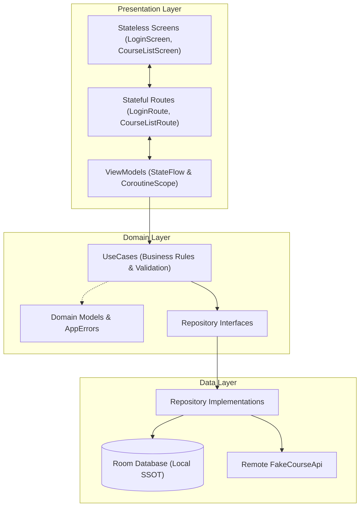
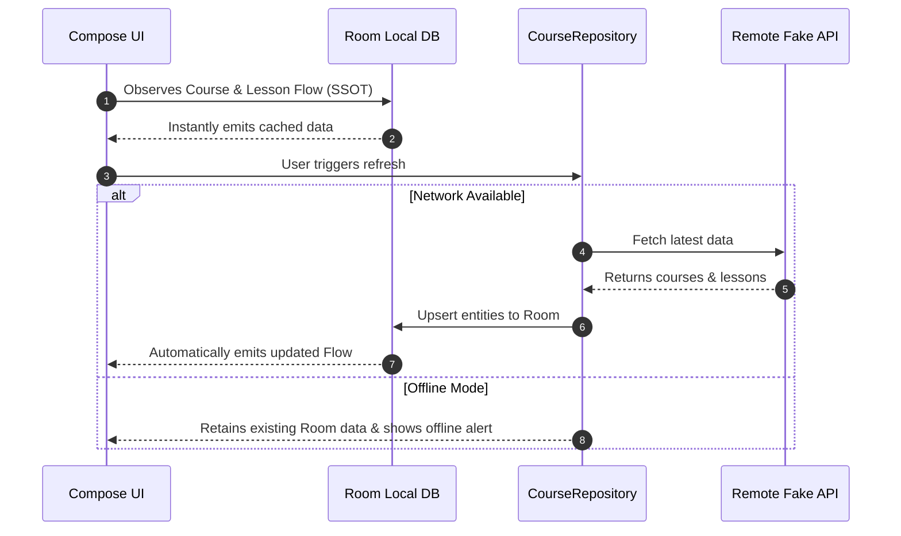
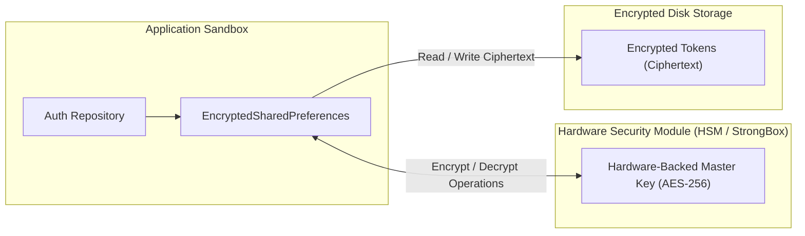

# Learnly - Android Learning Dashboard

**Learnly** is a modern, offline-first Android application built with **Kotlin** and **Jetpack Compose**. It provides an engaging learning dashboard featuring course progress tracking, interactive lesson completion checklists, and session authentication.

---

## 1. Architecture & Why It Was Used

The project strictly follows **Clean Architecture** combined with **Unidirectional Data Flow (UDF)**, separating code into three decoupled layers:

- **Presentation Layer**: Built with **Jetpack Compose**. Structured into stateful **Routes** (`*Route.kt`) that manage ViewModels and state observation, and stateless **Screens** (`*Screen.kt`) that handle pure UI rendering.
- **Domain Layer**: Contains business rules and application logic in single-responsibility **UseCases** (`LoginUseCase`, `GetCoursesUseCase`, `ToggleLessonCompletionUseCase`, etc.).
- **Data Layer**: Implements the **Repository Pattern**, orchestrating local persistence in **Room Database** and remote synchronization via a **Remote API** with typed sealed error handling.

### Why this architecture was chosen:
It provides clear **Separation of Concerns**, making the codebase highly testable, maintainable, and scalable. Business logic remains completely independent of Android framework APIs, UI composables remain stateless for painless previews and UI tests, and data sources can be modified or replaced without touching UI logic.

*(Note: Manual Dependency Injection via `AppContainer` and `LocalAppContainer` was used instead of Dagger/Hilt to keep the project lightweight, eliminate annotation processing overhead, and maintain fast build times for this scope).*

*(Note: ViewModels are initialized directly inside their respective feature routes, keeping `AppNavHost` purely responsible for routing and navigation transitions).*

---

## 2. Offline Storage & Network Resilience

**Learnly** is designed around an **Offline-First** model, utilizing the **Room Database** as the application's **Single Source of Truth (SSOT)**:

- **Local Persistence First**: The UI never consumes network responses directly. Instead, it observes reactive Kotlin `Flow` streams directly from Room. Network responses are written to Room, which automatically emits updated data to the UI.
- **Real-Time Network Monitoring**: The **`NetworkManager`** monitors device connectivity using Android's `ConnectivityManager`. When offline, network calls are safely bypassed, and local data is displayed instantly.
- **Session State Persistence**: User login sessions are saved in **Jetpack Preferences DataStore**, allowing the app to restore authenticated sessions across app launches.
- **Offline Safeguards**: Offline login attempts and logouts are safeguarded with auto-dismissing dialogs and warning banners, preventing unauthorized actions and data inconsistency while disconnected.

*(Note: Lesson completion is the sole source of truth for course progress. Progress percentages are calculated dynamically in Room flows, guaranteeing consistency across screens even when offline).*

---

## 3. Production Security with Android Keystore

In a production environment, sensitive authentication tokens (e.g., **JWT access & refresh tokens**) and credentials must never be stored in plain text. Instead, production security is enforced using the **Android Keystore System** alongside **EncryptedSharedPreferences** or **EncryptedDataStore**.

The Android Keystore generates and stores cryptographic keys inside a dedicated **Hardware Security Module (HSM)** or **StrongBox Keymaster**. Cryptographic operations (AES-256-GCM / AES-256-SIV) are performed directly within this hardware boundary. The private keys never enter application memory and cannot be extracted, even on rooted devices.

*(Note: The Android `BiometricPrompt` API can be layered on top of Keystore keys to require user fingerprint or facial verification before decrypting sensitive tokens).*

---

## 4. Scaling for 1M+ Users & High Concurrency

To support **1 million active users** and **hundreds of courses**, the following architectural and production enhancements would be implemented:

- **Resilient Production Networking**:
  - Implement a type-safe **Retrofit** API service paired with **Kotlinx Serialization** for high-throughput, low-overhead JSON parsing.
  - Add an OkHttp **Auth Interceptor** for automatic `Bearer` JWT header injection, plus an OkHttp **`Authenticator`** to seamlessly refresh expired access tokens on `401 Unauthorized` without dropping in-flight user requests.
  - Enforce **Certificate Pinning** (`CertificatePinner`) to guard against Man-in-the-Middle (MitM) exploits, and leverage HTTP/2 / HTTP/3 connection multiplexing with adaptive retry policies.
- **Robust Dependency Injection at Scale (Dagger / Hilt)**:
  - Replace manual `AppContainer` with **Dagger / Hilt** to eliminate manual factory boilerplate across ViewModels using `@HiltViewModel` and constructor `@Inject`.
  - Enforce hierarchical lifecycle scopes (**`@Singleton`**, **`@ActivityRetainedScoped`**, **`@ViewModelScoped`**) to prevent memory leaks and bind dependencies across decoupled Gradle feature modules.
  - Enable frictionless test double substitution in automated test suites via **`@TestInstallIn`** and **`@BindValue`**.
- **Build Variants & Product Flavors**:
  - Configure environment flavors (`dev`, `staging`, `prod`) combined with build types (`debug`, `release`).
  - Enables distinct `applicationIdSuffix` (e.g. `.dev`), unique app icons and labels for side-by-side installations, and environment-specific endpoints (`BuildConfig.BASE_URL`).
- **Proper R8 & ProGuard Optimization**:
  - Enforce code shrinking, aggressive method inlining, dead-code removal, and resource shrinking (`shrinkResources true`, `minifyEnabled true`).
  - Provide targeted keep rules for Room entities, data transfer objects (DTOs), and serialization models to safeguard against runtime reflection crashes while minimizing APK download size and memory overhead.
- **CI/CD Pipelines**:
  - Automate build verification through workflows (e.g., GitHub Actions / Bitrise / GitLab CI) executing lint checks (`./gradlew lint`), automated unit tests (`./gradlew testDebugUnitTest`), and release Android App Bundle (AAB) packaging.
  - Automate deployments to Firebase App Distribution for internal testers and the Google Play Console Internal Track.
- **A/B Testing & Feature Flagging**:
  - Integrate remote configuration services (e.g., Firebase Remote Config / LaunchDarkly) with client-side experiment evaluation.
  - Enable phased percentage rollouts, instant feature kill switches, and analytical event tracking to evaluate conversion metrics across cohorts.
- **App Signing & Keystore Management**:
  - Leverage **Google Play App Signing**, ensuring Google securely stores and manages the root app signing key.
  - Maintain upload keys isolated in CI/CD secret vaults (e.g., GitHub Secrets) rather than committed to source control, with cryptographic verification before deployment.
- **Observability & APM**: Integrate **OpenTelemetry** and distributed tracing to monitor network latency, database query performance, and user interaction metrics in real time.
- **Crashlytics & Error Reporting**: Add **Firebase Crashlytics** with custom breadcrumbs, non-fatal exception logging, and user session tagging for rapid issue resolution.
- **Proper UI Previews & Design System**: Build a dedicated **Component Catalog** with comprehensive `@Preview` configurations covering dark mode, font scaling, and various device form factors.
- **Theming & Material 3**: Implement full **Dynamic Color (Material You)** theming with standardized semantic color, typography, and elevation tokens across the application.
- **Animations & Micro-interactions**: Add **Shared Element Transitions** between the course list and details screens, animated progress bars, and shimmer placeholder effects during initial load.
- **Android SplashScreen API**: Implement the official **`androidx.core.splashscreen`** API with animated vector branding while validating DataStore session state.
- **Onboarding Flow**: Introduce a multi-page interactive **Onboarding Carousel** for first-time users to highlight key platform features and learning workflows.
- **Background Sync**: Utilize **Android WorkManager** with `NetworkType.CONNECTED` constraints and exponential backoff to sync offline lesson completions silently in the background.
- **Caching & CDN**: Deploy multi-layer HTTP caching via **OkHttp Cache** headers, and integrate **Coil** with disk/memory LRU caches for optimized course banners and avatars delivered via a global CDN.
- **Pagination**: Implement **Jetpack Paging 3** with `RemoteMediator` to stream course lists from Room in pages (e.g., 20 items per chunk), preventing excessive memory usage.
- **Modularization**: Break down the monolithic app module into feature and core modules (`:core:model`, `:core:database`, `:feature:login`, `:feature:courses`) for faster incremental builds and dynamic feature delivery.

*(Note: Implementing Room database indexing on foreign keys (`@Index(value = ["courseId"])`) and Room FTS (Full-Text Search) is critical to keeping searches fast with hundreds of courses).*

---

## 5. iOS Equivalent Implementation

A native **iOS** version of **Learnly** would mirror this architecture using Apple's modern first-party frameworks:

- **User Interface**: Built with **SwiftUI**, using `NavigationStack` for routing, `LazyVStack` for performant list rendering, and `@Binding` for stateless component communication.
- **Architecture**: **MVVM + Clean Architecture**, leveraging the **`@Observable`** macro (iOS 17+) or `ObservableObject` with `@Published` to publish UI states.
- **Concurrency & Reactive Streams**: Powered by **Swift Concurrency** (`async`/`await`, `AsyncStream`, `TaskGroup`) and Apple **Combine** for reactive state pipelines.
- **Local Persistence**: **SwiftData** (or **GRDB / SQLite**) acting as the local Single Source of Truth with the `@Query` macro observing entity changes reactively.
- **Networking**: Configured using **`URLSession`** with custom `URLSessionDelegate` for certificate pinning, or **Alamofire** with `RequestInterceptor` for automatic token refresh.
- **Dependency Injection**: Managed via **Factory**, Swift `@Environment`, or **Swinject** for decoupled modular container resolution.
- **Network Monitoring**: Apple's **`Network.framework`** using **`NWPathMonitor`** to stream real-time connectivity status.
- **Secure Token Storage**: Stored in **Apple Keychain Services** backed by the hardware **Secure Enclave**, mirroring Android's Keystore.
- **Background Tasks**: Handled by **`BGTaskScheduler`** (`BGAppRefreshTask`) to synchronize lesson progress and course updates while the app is in the background.

### Architectural Mapping

| Component | Android Implementation | iOS Equivalent |
| :--- | :--- | :--- |
| **Language** | Kotlin | Swift (Swift 6) |
| **UI Framework** | Jetpack Compose | SwiftUI |
| **Architecture** | MVVM + Clean Architecture | MVVM + Clean Architecture (`@Observable`) |
| **Networking** | Retrofit + OkHttp | `URLSession` / Alamofire |
| **Dependency Injection** | Hilt / Dagger (or `AppContainer`) | Factory / Swift `@Environment` / Swinject |
| **Local Database (SSOT)** | Room (SQLite) | SwiftData / GRDB |
| **Reactive Streams** | Kotlin Coroutines & `Flow` | Swift Concurrency (`AsyncStream`) & Combine |
| **Network Monitoring** | `ConnectivityManager` | `NWPathMonitor` (`Network.framework`) |
| **Hardware Key Storage** | Android Keystore / StrongBox | Apple Keychain / Secure Enclave |
| **Session Persistence** | Jetpack DataStore | UserDefaults / Keychain |
| **Background Sync** | WorkManager | `BGTaskScheduler` (`BGAppRefreshTask`) |
| **Image Caching** | Coil | Kingfisher / Nuke |

*(Note: Thanks to Swift Concurrency and SwiftUI's declarative paradigm, the unidirectional data flow pattern translates 1-to-1 between the Android and iOS implementations).*

---

## 6. Pre-built APKs

Pre-built and signed installable APK binaries are generated and organized directly in the root [`Apks/`](file:///home/saneen/AndroidStudioProjects/Learnly/Apks) directory:
- **Debug APK**: [`Apks/app-debug.apk`](file:///home/saneen/AndroidStudioProjects/Learnly/Apks/app-debug.apk) (13 MB) — Built with debuggable symbols and logging enabled.
- **Release APK**: [`Apks/app-release.apk`](file:///home/saneen/AndroidStudioProjects/Learnly/Apks/app-release.apk) (8.9 MB) — Built with release optimization and signed for direct installation.

*(Note: Pre-built APKs are located in the [Apks/](file:///home/saneen/AndroidStudioProjects/Learnly/Apks) folder at the root of the project for immediate side-loading and manual testing on devices or emulators).*
